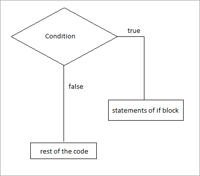
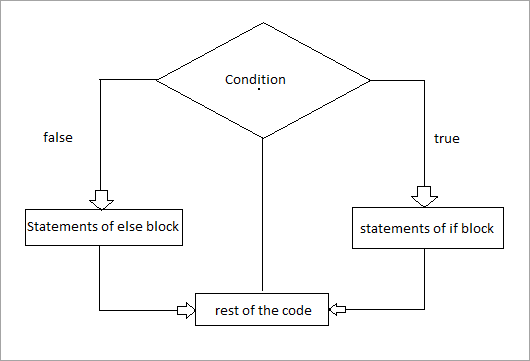

### Introduction
When building the logging system of a software or website, how do you authenticate or verify that the user filling the logging form is an authorized or registered user to the software or website? This is where conditional statements come into play.
Conditional statements execute computation only when a specific boolean constraint evaluates to either true or false. Programming languages use `if statements` to handle conditional statements. Below is a list of conditional statements used in programming.
- if statement
- if-else statement
- else if statement
- nested if statement.

Every programming language has its way of implementing these statements, this article will focus on python implementation.

### IF Statements in python 

The if statement determines if a block of code or a statement should be executed or not, it checks to see if a certain condition evaluates to true before it executes otherwise it doesn't execute. The if statement only executes a block of code if the boolean expression resolves to true, the code snippet below shows how to write an if statement in python.
```python
if ( condition ):
     Block of code
```
from the code snippet above the condition is always inside a parenthesis(bracket) and the block of code to be executed is always below the condition with an indented space. also note that there is a `: (column)` at the end of the conditional statement the column tells python the end of the condition. Below is a flowchart of an if statement.



Below is an example of if statements in python.

```python
# code 
list = ['john', 'nats', 'kate']

name= 'john'

if (name in list):
    print("you are a member")

# output
you are a member

```
The code above will give an output `you are a member because the name `john` is in the [list](https://www.bindlearn.com/post/array/)

### if-else Statement
The if-else statement is an if statement with an else condition. The code block in the else statement executes only if the condition in the if statement evaluates to false. The if statement is structured such that If the condition is TRUE, the code present in the “ if “ block will be executed otherwise the code of the “else“ block will be executed. Below is how an if-else statement is structured.

```python
if (Condition):
    Code block
else:
    Code block
```
from the snippet above you can see how the if and else are indented, it shows that the if and else are in the same block indentation is very important in python. The image below shows a flowchart of an if-else statement.



The code snippet below shows an example of an if-else statement.

```python
# code example
list = ['john', 'nats', 'kate']

name= 'James'

if (name in list):
    print("you are a member")

else:
    print("you are not a member")

# Output
you are not a member
```
The code snippet will print out `you are not a member because the name `James is not found in the [list](https://www.bindlearn.com/post/array/).

### elif Statement
The `elif` statement in python is the same as `else if` statement in other programming languages. The `elif` statement and an `if-else` statement are similar their only difference is that the `else` doesn't check a condition before it executes a block of code while the `elif` check for a condition before it executes a code. The `elif` is used when developers want to check for multiple conditions, the `elif` only checks for a condition only if the previous condition resolves to `False`. The snippet below shows how an `elif` statement is structured.

```python
if (condition):
    code to be executed
elif (condition):
    code to be executed
else:
    code to be executed
```

The code snippet below shows an example of an elif statement

#### elif example
```python
username = 'john001'

username_input= input("enter username: ")

if len(username_input) < 1:
    print("username field can't be empty, please input username")

elif username_input == username:
    print("User Name is correct")

else:
    print("Incorrect username")

```
The code snippet above is an example of username validation. From the code snippet, a `username` was declared, then a username input field (`username_input`) was declared to accept username input from users. The two conditions the code is trying to check are;

1. to make sure an input field is not blank.
2. to make sure the username is the same as the username stored in the code. 

To accomplish this an `if statement` is written to check the length of the data input by the user, then an `elif` will check to make sure the username is correct, and lastly the `else` gives the user a message if the input *username* and the stored username is not the same.

The example code will print *username field can't be empty, please input username* if an empty field is submitted, it will print *"User Name is correct"* if the input username and the stored username is the same, and will print *Incorrect username* if the input username and the stored username is not the same.

### Nested if statement
An if statement is said to be nested if it is in another if statement. In simple terms a nested if statement is an if statement inside another if statement. Below shows how a nested if statement is structured.

```python
if(condition):
           Code to execute
           if(condition):
                    Code to execute
           #end of nested if
#end of if
```

The code snippet below is an example of a nested if statement.
```python
# code example
users = ['john', 'nats', 'kate']

user= 'nats'

if (user in users):
    if (user=='john'):
        print("Your name is " + name + " and you are the choosen one")
    else:
        print("You are a member but you are not the choosen one")

else:
    print("you are not a member")

```
The program above is looking for a user who is the chosen one. To accomplish this just as shown in the code snippet above, the first `if statement` is validating to make sure the `user` is part of the list of `users` after validating, the `nested if statement` then checks if the user is the chosen one. A `nested if statement` is very important because they help in handling conditions that depend on other conditions.

### Conclusion
Conditional statements are the backbone of handling case scenarios when programming. When building software programmers make sure the software handles all case scenarios because there is always another way to do anything. Unless a developer doesn't want to build software humans will use, the understanding conditional statement is a must.

