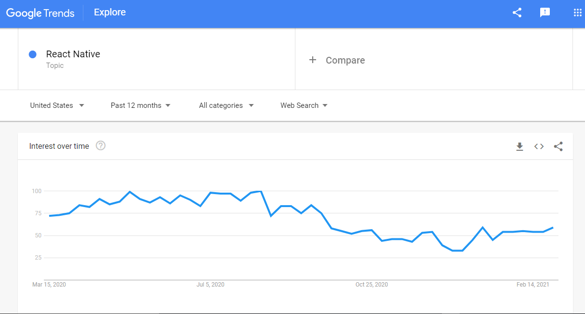

Functions are one of the fundamental building blocks in JavaScript. A function in JavaScript is similar to a procedure—a set of statements that performs a task or calculates a value, but for a procedure to qualify as a function, it should take some input and return an output where there is some obvious relationship between the input and the output. To use a function, you must define it somewhere in the scope from which you wish to call it.



### Defining functions  

A function definition (also called a function declaration, or function statement) consists of the function keyword, followed by:

The name of the function.
A list of parameters to the function, enclosed in parentheses and separated by commas.
The JavaScript statements that define the function, enclosed in curly brackets, {...}.
For example, the following code defines a simple function named square:

```js
function square(number) {
  return number * number;
}
```
The function square takes one parameter, called number. The function consists of one statement that says to return the parameter of the function (that is, number) multiplied by itself. The statement return specifies the value returned by the function:
```js
return number * number;
```

Primitive parameters (such as a number) are passed to functions by value; the value is passed to the function, but if the function changes the value of the parameter, this change is not reflected globally or in the calling function.

If you pass an object (i.e., a non-primitive value, such as Array or a user-defined object) as a parameter and the function changes the object's properties, that change is visible outside the function, as shown in the following example:

```js
function myFunc(theObject) {
  theObject.make = 'Toyota';
}

var mycar = {make: 'Honda', model: 'Accord', year: 1998};
var x, y;

x = mycar.make; // x gets the value "Honda"

myFunc(mycar);
y = mycar.make; // y gets the value "Toyota"
                // (the make property was changed by the function)
```